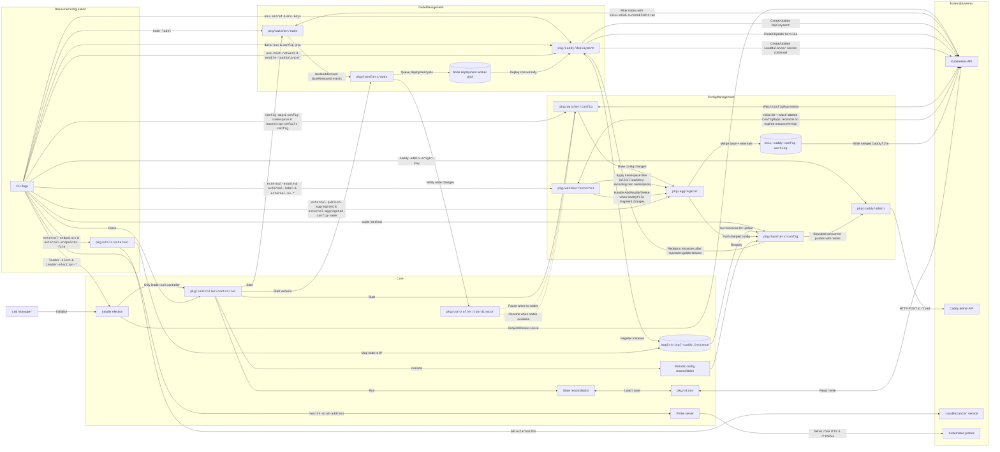

# CKIC

## Technical Structure

```mermaid
flowchart LR
    Main["<code>cmd/manager</code>"] --> |"Initialize"| LeaderElection
    LeaderElection["Leader election"] --> |"Only leader runs controller"| Controller
    LeaderElection --> |"Acquire/Renew <code>Lease</code>"| K8sAPI
    CLIFlags["CLI flags"] --> |"Parse"| Controller
    CLIFlags --> |"<code>leader-elect</code> & <code>leader-election-*</code>"| LeaderElection
    CLIFlags --> |"<code>health-bind-address</code>"| ProbeServer
    CLIFlags --> |"<code>node-label</code>"| NodeWatcher
    CLIFlags --> |"<code>config-map</code> & <code>config-namespace</code> & <code>bootstrap-default-config</code>"| ConfigWatcher
    CLIFlags --> |"<code>env-secret</code> & <code>env-keys</code>"| CaddyDeployer
    CLIFlags --> |"<code>data-pvc</code> & <code>config-pvc</code>"| CaddyDeployer
    CLIFlags --> |"<code>external-endpoints</code> & <code>external-endpoints-file</code>"| ExternalIPParser
    CLIFlags --> |"<code>comm-method</code>"| ConfigHandler
    CLIFlags --> |"<code>caddy-admin-origin-key</code>"| CaddyAdminClient
    CLIFlags --> |"<code>use-host-network</code> & <code>enable-loadbalancer</code>"| CaddyDeployer

    Controller["<code>pkg/controller/controller</code>"] --> |"Run"| StateReconciliation
    Controller --> |"Start workers"| NodeHandler
    Controller --> |"Start"| NodeWatcher
    Controller --> |"Start"| ConfigWatcher
    Controller --> |"Periodic"| ConfigReconciliation

    NodeWatcher["<code>pkg/watcher/node</code>"] <--> |"Filter nodes with <code>ckic.cmld.ru/enabled=true</code>"| K8sAPI
    NodeWatcher --> |"<code>NodeAdded</code> and <code>NodeRemoved</code> events"| NodeHandler
    NodeHandler["<code>pkg/handlers/node</code>"] --> |"Queue deployment jobs"| DeploymentWorkerPool
    NodeHandler --> |"Notify node changes"| WatcherCoordinator

    DeploymentWorkerPool[("Node deployment worker pool")] --> |"Deploy concurrently"| CaddyDeployer
    CaddyDeployer["<code>pkg/caddy/deployment</code>"] --> |"Create/Update <code>Deployment</code>"| K8sAPI
    CaddyDeployer --> |"Create/Update <code>Service</code>"| K8sAPI
    CaddyDeployer --> |"Create/Update <code>LoadBalancer</code> service <i>(optional)</i>"| K8sAPI

    CaddyDeployer --> |"Register instance"| InstanceRegistry
    InstanceRegistry[("<code>map[string]*caddy.Instance</code>")] --> |"Get instances for update"| ConfigHandler

    ConfigWatcher["<code>pkg/watcher/config</code>"] <--> |"Watch <code>ConfigMap</code> events"| K8sAPI
    ConfigWatcher --> |"Base config changed"| Aggregator
    ExternalConfigWatcher["<code>pkg/watcher/external</code>"] <--> |"Initial list + watch labeled <code>ConfigMap</code>s; reconcile on expired resourceVersion"| K8sAPI
    ExternalConfigWatcher --> |"Apply namespace filter (<code>all</code>/<code>allow</code>/<code>deny</code>, excluding own namespace)"| Aggregator
    ExternalConfigWatcher --> |"Handle Add/Modify/Delete when <code>Caddyfile</code> fragment changes"| Aggregator
    Aggregator["<code>pkg/aggregator</code>"] --> |"Merge base + externals"| MirrorConfigMap
    Aggregator --> |"Push merged config"| ConfigHandler
    MirrorConfigMap[("<code>ckic-caddy-config-working</code>")] --> |"Write merged <code>Caddyfile</code>"| K8sAPI
    ConfigHandler["<code>pkg/handlers/config</code>"] --> |"Bounded concurrent pushes with retries"| CaddyAdminClient
    ConfigHandler --> |"Redeploy instances after repeated update failures"| CaddyDeployer

    CaddyAdminClient["<code>pkg/caddy/admin</code>"] --> |"HTTP POST to <code>/load</code>"| CaddyAdminAPI

    WatcherCoordinator["<code>pkg/controller/coordinator</code>"] -.-> |"Pause when no nodes"| ConfigWatcher
    WatcherCoordinator -.-> |"Resume when nodes available"| ConfigWatcher

    CLIFlags --> |"<code>external-enable</code> & <code>external-label</code> & <code>external-ns-*</code>"| ExternalConfigWatcher
    CLIFlags --> |"<code>external-publish-aggregated</code> & <code>external-aggregated-config-name</code>"| Aggregator

    ExternalIPParser["<code>pkg/utils/external</code>"] --> |"Map node to IP"| InstanceRegistry
    ExternalIPParser --> |"Set <code>externalIPs</code>"| K8sLoadBalancer

    StateReconciliation["State reconciliation"] <--> |"Load / save"| ConfigMapStateStore
    ConfigMapStateStore["<code>pkg/state</code>"] <--> |"Read / write"| K8sAPI
    ConfigReconciliation["Periodic config reconciliation"] --> |"Reapply"| ConfigHandler

    ProbeServer["Probe server"] --> |"Serve <code>/healthz</code> & <code>/readyz</code>"| K8sProbes

    K8sAPI["Kubernetes API"]
    CaddyAdminAPI["Caddy admin API"]
    K8sLoadBalancer["<code>LoadBalancer</code> service"]
    K8sProbes["Kubernetes probes"]

    subgraph Core
        LeaderElection
        Controller
        WatcherCoordinator
        StateReconciliation
        ConfigReconciliation
        InstanceRegistry
        ConfigMapStateStore
        ProbeServer
    end

    subgraph NodeManagement
        NodeWatcher
        NodeHandler
        DeploymentWorkerPool
        CaddyDeployer
    end

    subgraph ConfigManagement
        ConfigWatcher
        ExternalConfigWatcher
        Aggregator
        MirrorConfigMap
        ConfigHandler
        CaddyAdminClient
    end

    subgraph ResourceConfiguration
        CLIFlags
        ExternalIPParser
    end

    subgraph ExternalSystems
        K8sAPI
        CaddyAdminAPI
        K8sLoadBalancer
        K8sProbes
    end
```
