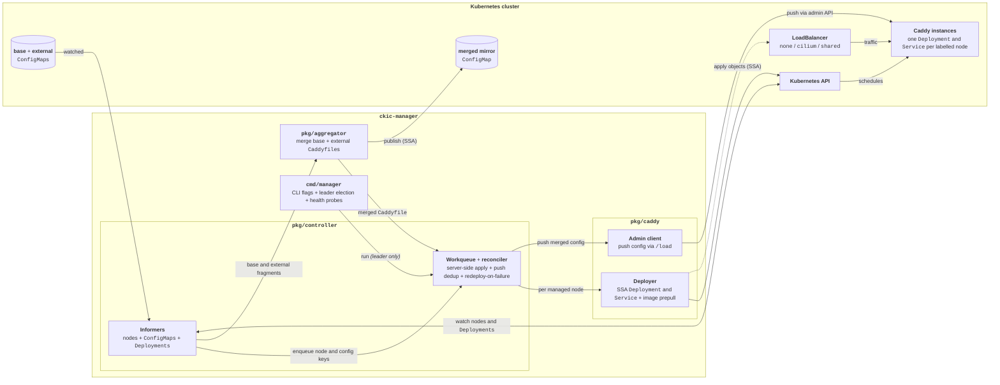

# CKIC

> Amateur Kubernetes operator that runs a dedicated [Caddy](https://caddyserver.com) instance on every selected node and keeps each instance's configuration continuously in sync.

## Technical Structure

