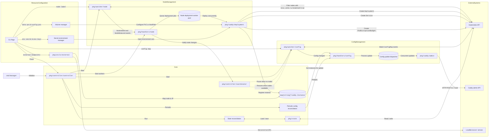

# CKIC

## Technical Structure

```mermaid
flowchart LR
    Main["<code>cmd/manager</code>"] --> |"Initialize"| Controller
    CLIFlags["CLI flags"] --> |"Parse"| Controller
    CLIFlags --> |"<code>node-label</code>"| NodeWatcher
    CLIFlags --> |"<code>config-map</code>"| ConfigWatcher
    CLIFlags --> |"<code>env-secret</code> & <code>env-keys</code>"| SecretEnvVars
    CLIFlags --> |"<code>data-pvc</code> & <code>config-pvc</code>"| VolumeManager
    CLIFlags --> |"<code>external-endpoints</code>"| ExternalIPParser

    Controller["<code>pkg/controller/controller</code>"] --> |"Run"| StateReconciliation
    Controller --> |"Start workers"| NodeHandler
    Controller --> |"Start"| NodeWatcher
    Controller --> |"Start"| ConfigWatcher
    Controller --> |"Periodic"| ConfigReconciliation

    NodeWatcher["<code>pkg/watcher/node</code>"] <--> |"Filter nodes with <code>ckic.cmld.ru/enabled=true</code>"| K8sAPI
    NodeWatcher --> |"<code>NodeAdded</code> and <code>NodeRemoved</code> events"| NodeHandler
    NodeHandler["<code>pkg/handlers/node</code>"] --> |"Queue deployment jobs"| DeploymentWorkerPool
    NodeHandler --> |"Notify node changes"| WatcherCoordinator

    DeploymentWorkerPool[("Node deployment worker pool")] --> |"Deploy concurrently"| CaddyDeployer
    CaddyDeployer["<code>pkg/caddy/deployment</code>"] --> |"Create <code>Deployment</code>"| K8sAPI
    CaddyDeployer --> |"Create <code>Service</code>"| K8sAPI
    CaddyDeployer --> |"Create <code>PodDisruptionBudget</code>"| K8sAPI

    CaddyDeployer --> |"Register instance"| InstanceRegistry
    InstanceRegistry[("<code>map[string]*caddy.Instance</code>")] --> |"Get instances for update"| ConfigHandler

    ConfigWatcher["<code>pkg/watcher/config</code>"] <--> |"Watch <code>ConfigMap</code> events"| K8sAPI
    ConfigWatcher --> |"Config changed"| ConfigHandler
    ConfigHandler["<code>pkg/handlers/config</code>"] --> |"Process update"| ConfigUpdateDispatcher
    ConfigUpdateDispatcher[("Config update dispatcher")] --> |"Concurrent updates"| CaddyAdminClient

    CaddyAdminClient["<code>pkg/caddy/admin</code>"] --> |"HTTP POST to <code>/load</code>"| CaddyAdminAPI

    WatcherCoordinator["<code>pkg/controller/coordinator</code>"] -.-> |"Pause when no nodes"| ConfigWatcher
    WatcherCoordinator -.-> |"Resume when nodes available"| ConfigWatcher

    ExternalIPParser["<code>pkg/utils/external</code>"] --> |"Map node to IP"| InstanceRegistry
    ExternalIPParser --> |"Set <code>externalIPs</code>"| K8sLoadBalancer

    StateReconciliation["State reconciliation"] <--> |"Load / save"| ConfigMapStateStore
    ConfigMapStateStore["<code>pkg/state</code>"] <--> |"Read / write"| K8sAPI
    ConfigReconciliation["Periodic config reconciliation"] --> |"Reapply"| ConfigHandler

    VolumeManager["Volume manager"] --> |"Configure PVC or HostPath"| CaddyDeployer
    SecretEnvVars["Secret environment manager"] --> |"Inject environment vars"| CaddyDeployer

    K8sAPI["Kubernetes API"]
    CaddyAdminAPI["Caddy admin API"]
    K8sLoadBalancer["<code>LoadBalancer</code> service"]

    subgraph Core
        Controller
        WatcherCoordinator
        StateReconciliation
        ConfigReconciliation
        InstanceRegistry
        ConfigMapStateStore
    end

    subgraph NodeManagement
        NodeWatcher
        NodeHandler
        DeploymentWorkerPool
        CaddyDeployer
    end

    subgraph ConfigManagement
        ConfigWatcher
        ConfigHandler
        ConfigUpdateDispatcher
        CaddyAdminClient
    end

    subgraph ResourceConfiguration
        CLIFlags
        ExternalIPParser
        VolumeManager
        SecretEnvVars
    end

    subgraph ExternalSystems
        K8sAPI
        CaddyAdminAPI
        K8sLoadBalancer
    end
```
